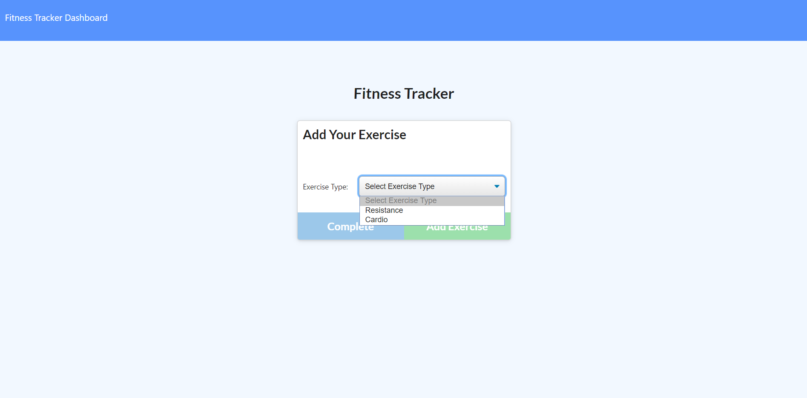
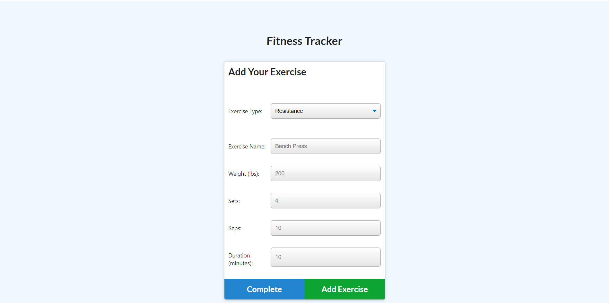
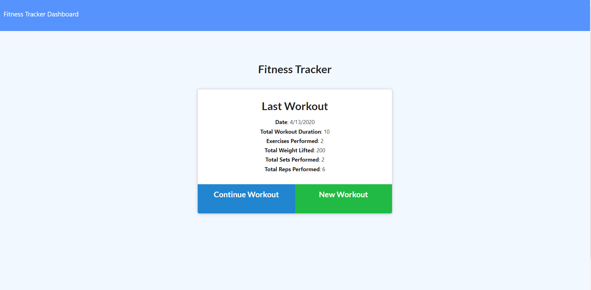
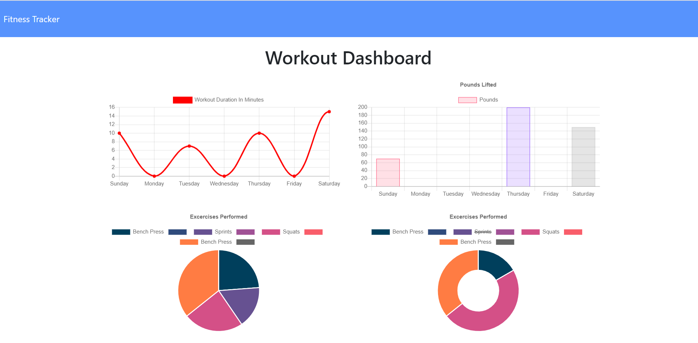

# Workout-Tracker

## Description

This app is a workout tracker. It was built using a Mongo database with a Mongoose schema and handles routes with Express.

When the user loads the page, they are given the option to create a new workout, or continue with their last workout.

The user is able to:

  * Select an exercise type (resistance/cardio)
  * Add new exercises to a new workout plan.
  * Add more exercises to a current workout.
  * View charts of workouts performed on the `dashboard` page.

## Business Context

A consumer will reach their fitness goals quicker when they track their workout progress.
